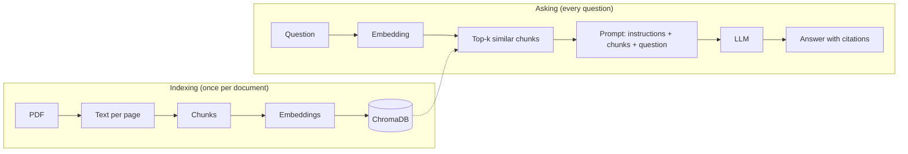

# StudyRAG

A local study assistant that answers questions about your own PDF notes and tells you exactly where each answer came from (document and page). It can also generate practice quizzes and summaries, and it measures how well it finds the right information.

Everything runs on your machine with [Ollama](https://ollama.com): no API keys, and your notes never leave your computer.

> **Status: early development.** The development environment is set up; the features below are being built phase by phase. See the [roadmap](#roadmap) for progress.

<!-- Demo GIF goes here once the Streamlit app is ready (phase 8). -->

## What it will do

- **Ask:** answer questions using only your documents, with citations like `[os-notes.pdf, p. 12]`. If the answer isn't in your notes, it says so instead of making something up.
- **Quiz:** generate multiple-choice questions on a topic, each with the correct answer, an explanation and the source page.
- **Summarize:** summarize a whole document or a range of pages.
- **Evaluate:** a script that measures retrieval quality (hit rate@k and MRR) and compares chunk sizes, overlap and top-k settings.

## Why build it from scratch

Frameworks like LangChain or LlamaIndex hide the parts of RAG that matter most. This project implements them by hand (PDF parsing, chunking, retrieval, prompt building and evaluation) to understand how each decision affects the quality of the answers. Design decisions and the numbers behind them are logged in [`docs/decisions.md`](docs/decisions.md).

## How it works



Each chunk keeps its document name and page number, so every answer can point back to its source.

## Tech stack

| Component | Choice |
| --- | --- |
| Language | Python 3.12 |
| PDF parsing | pypdf |
| Chunking | Custom implementation |
| LLM | Ollama (`qwen2.5:3b` or `qwen2.5:7b`) |
| Embeddings | Ollama (`bge-m3`, multilingual) |
| Vector store | ChromaDB |
| Structured output | Pydantic |
| UI | Streamlit |
| Quality | pytest, ruff, GitHub Actions |

## Getting started

### Prerequisites

- Python 3.12 or newer
- [Ollama](https://ollama.com/download)
- About 6 GB of free disk space for the models

Pick the LLM based on your hardware. `qwen2.5:7b` gives better answers but needs more memory; on a GPU with 4 GB of VRAM, `qwen2.5:3b` is much faster (see [`docs/decisions.md`](docs/decisions.md) for measurements).

```bash
ollama pull qwen2.5:3b
ollama pull bge-m3
```

### Installation

Windows (PowerShell):

```powershell
git clone https://github.com/Yarart3/studyrag.git
cd studyrag
py -3.12 -m venv .venv
.\.venv\Scripts\Activate.ps1
python -m pip install -e ".[dev]"
```

macOS / Linux:

```bash
git clone https://github.com/Yarart3/studyrag.git
cd studyrag
python3.12 -m venv .venv
source .venv/bin/activate
python -m pip install -e ".[dev]"
```

### Run the checks

```bash
pytest
ruff check .
```

Usage instructions for the CLI and the web app will be added as those parts are built.

## Project structure

```
studyrag/
├── src/studyrag/     # The package: ingestion, retrieval, LLM providers
├── tests/            # pytest suite
├── app/              # Streamlit interface (planned)
├── eval/             # Evaluation dataset and scripts (planned)
├── docs/             # Architecture notes and decision log
└── data/             # Your PDFs and the vector database (git-ignored)
```

Your documents and the database live in `data/`, which is never committed.

## Roadmap

- [x] **Phase 0:** development environment, project skeleton, local models
- [ ] **Phase 1:** PDF loading, page by page
- [ ] **Phase 2:** custom chunking with overlap
- [ ] **Phase 3:** embeddings and ChromaDB indexing
- [ ] **Phase 4:** question answering with citations
- [ ] **Phase 5:** Streamlit interface
- [ ] **Phase 6:** quiz generation and summaries
- [ ] **Phase 7:** retrieval evaluation (hit rate@k, MRR)
- [ ] **Phase 8:** CI, documentation and demo

## License

[MIT](LICENSE)
